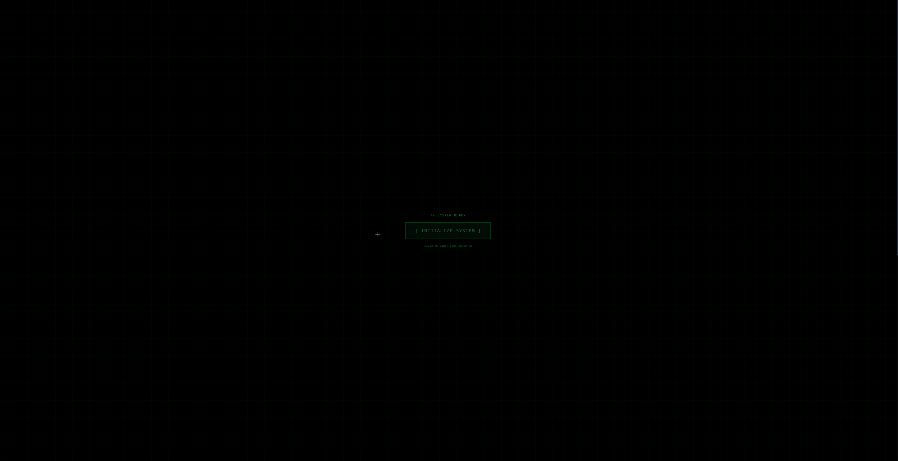

<div align="center">
  <h3>DIGITAL_ARTIFACTS_OS // SYSTEM_READY</h3>
  <p>Brutalist, siberpunk esintili bir işletim sistemi portfolyo arayüzü.</p>

  <!-- Dil Seçimi (Language Switcher) -->
  <a href="README.md"></a>
  <a href="README.TR.md"></a>

  <br /><br />

  [](https://chelebyy.github.io)
  [](https://github.com/chelebyy/chelebyy.github.io/actions)

  <br />

  [](https://react.dev/)
  [](https://www.typescriptlang.org/)
  [](https://vitejs.dev/)
  [](https://vitest.dev/)
  [](LICENSE)

</div>

---

## 📸 Sistem Görselleri



> *Güvenli Sektör Erişimi & Matrix Modu Görselleştirmesi*

---

## ⚡ Sistem Genel Bakışı

**Digital Artifacts OS** sadece bir portfolyo web sitesi değildir; mühendislik yeteneklerini ham işlevsellik ve estetikle sergilemek için tasarlanmış etkileşimli bir terminal ortamıdır. Modern web'in gürültüsünü ortadan kaldırarak performansa, etkileşime ve belirgin bir "hacker" havasına odaklanır.

### 🚀 Temel Özellikler

* **🖥️ Komut Paleti (God Mode):**
  * Sistem terminaline erişmek için `Ctrl + K` tuşlarına basın veya "Depoyu_Bagla" butonuna tıklayın.
  * `matrix`, `neofetch`, `theme`, `whoami` gibi komutları çalıştırın.
  * **Sürpriz Yumurta:** `sudo lütfen` yazarak kibarca istemeyi deneyin (veya İngilizce `sudo please`).

* **🟢 Matrix Modu:**
  * Komut paleti üzerinden tamamen render edilmiş HTML5 Canvas Matrix Yağmuru efektini açıp kapatın.
  * *Komut:* `matrix`

* **🔒 Güvenli Sektör:**
  * Hassas veya "gizli" projeler için gizlenmiş, şifre korumalı bir alan.
  * Hayatın anlamı, evren ve her şeye dair kriptik bir kilit açma mekanizması içerir.

* **🎬 Dijital Uyanış (Boot Dizisi):**
  * BIOS kontrolleri, kimlik doğrulama ve glitch efektleri içeren sinematik "Sistem Başlatma" girişi.
  * Rahatsızlık vermeden sürükleyiciliği korumak için oturum başına bir kez çalışır.
  * *Tekrar Deneyimle:* Terminale `reboot` yazarak diziyi yeniden başlatın.

* **📊 Aktif Sistem Monitörü:**
  * Canlı sistem modüllerini (Docker, AI Model, Firewall) görselleştiren yeniden tasarlanmış bir protokol alanı.
  * Sistem durumuna tepki veren dinamik durum göstergeleri (Çalışıyor, Optimize, Filtreleniyor).

* **🌍 Yerelleştirme Desteği:**
  * **İngilizce (EN)** ve **Türkçe (TR)** için tam ikidilli destek.
  * Tüm sistem loglarını, arayüz öğelerini ve hatta komut yanıtlarını güncelleyen anlık dil değişimi.

* **📡 Gerçek Zamanlı Veri:**
  * **Canlı Metrikler:** Gerçek zamanlı RAM dalgalanmaları, CPU kullanım simülasyonu ve Ağ kalp atışı.
  * **GitHub Entegrasyonu:** *Gerçek* commit geçmişini, push olaylarını ve repoları doğrudan GitHub API'sinden çeker.

* **🔊 Sürükleyici Ses Sistemi:**
  * Arayüz genelinde sinematik ses geri bildirimleri.
  * Boot dizisi sesleri, log terminal efektleri ve üzerine gelme (hover) etkileşimleri.
  * Siberpunk atmosferini güçlendiren bağlama duyarlı sesler.

---

## 🏗️ Mimari ve Dağıtım

Bu proje **Clean Architecture** prensiplerini takip eder ve modern bir **CI/CD** hattı kullanır.

### 🔄 Otomatik CI/CD (GitHub Actions)

`main` dalına yapılan her push, otomatik bir iş akışını tetikler:

1. **Test:** 25+ Birim Testi & 9 E2E Testi çalıştırılır.
2. **Derleme (Build):** Uygulama Vite kullanılarak derlenir.
3. **Temiz Sürüm:** Son kullanıcılar için geliştirici dosyalarından arındırılmış temiz bir `.zip` paketi oluşturulur.
4. **Dağıtım (Deploy):** GitHub Pages otomatik olarak güncellenir.

### 🧪 Sistem Bütünlüğü (Testler)

Kapsamlı bir test paketi ile güvenilirliğe öncelik veriyoruz:

* **Birim Testleri (Vitest):** Bireysel bileşenleri kapsar (Header, Sidebar, ProjectCard vb.).
* **E2E Testleri (Playwright):** Kritik kullanıcı akışlarını doğrular (Boot dizisi, Matrix Toggle, Navigasyon).

---

## 🗺️ Cyber Map (Yakında)

* Konum işaretleyicileri ile animasyonlu dünya haritası görselleştirmesi.
* Gerçek zamanlı bağlantı görselleştirme efektleri.

## 🛠️ Kurulum ve Başlatma

Sistemi kendi makinenizde yerel olarak çalıştırın:

```bash
# 1. Depoyu klonlayın
git clone https://github.com/chelebyy/chelebyy.github.io.git

# 2. Dizin içine girin
cd chelebyy.github.io

# 3. Bağımlılıkları yükleyin
npm install

# 4. Sistemi başlatın
npm run dev
```

## ⌨️ Sistem Komutları

`Ctrl + K` ile terminale erişin ve şunları deneyin:

| Komut | Açıklama |
| :--- | :--- |
| `help` | Kullanılabilir komutları listeler |
| `matrix` | Matrix Yağmuru görsel efektini açar/kapatır |
| `neofetch` / `sys` | Detaylı sistem özelliklerini gösterir |
| `theme [renk]` | Sistem vurgu rengini değiştirir (blue, red, green, purple) |
| `contact` | İletişim protokolünü başlatır |
| `reboot` / `restart` | Sistem Başlatma Dizisini (Boot) yeniden başlatır |
| `whoami` | Mevcut kullanıcı kimliğini görüntüler |

## 🤖 Destekleyen Teknolojiler

Bu proje, yeni nesil yapay zeka ajanlarının yardımıyla inşa edilmiştir:

* **Gemini 3.0 Pro:** Hızlı Prototipleme & Arayüz Üretimi
* **Antigravity:** Kod Mimarisi & Ajan İş Akışı
* **Claude:** Derin Muhakeme & Refactoring

---

<div align="center">
  <sub>Designed & Engineered by <a href="https://github.com/chelebyy">@chelebyy</a></sub>
</div>
