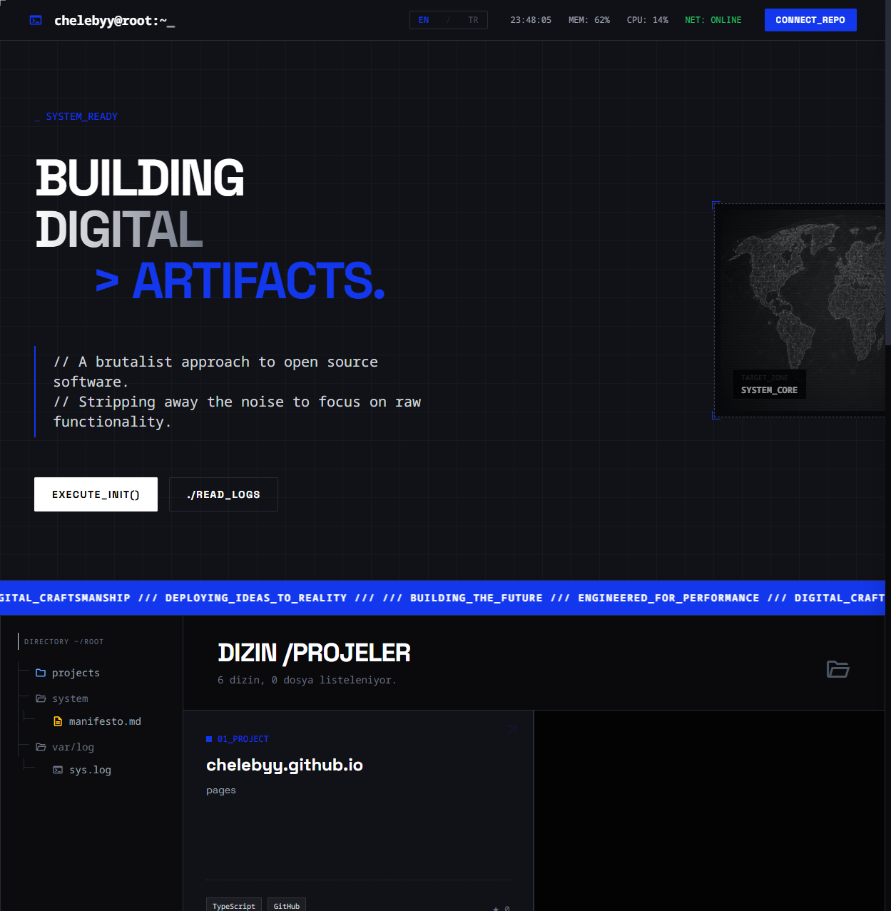

<div align="center">
  <h3>DIGITAL_ARTIFACTS_OS // SYSTEM_READY</h3>
  <p>A brutalist, cyberpunk-inspired operating system portfolio interface.</p>

  [](https://chelebyy.github.io)
  
  <br />

  [](https://react.dev/)
  [](https://www.typescriptlang.org/)
  [](https://tailwindcss.com/)
  [](https://vitejs.dev/)
  [](LICENSE)

</div>

---

## 📸 System Visuals



> *Secure Sector Access & Matrix Mode Visualized*

---

## ⚡ System Overview

**Digital Artifacts OS** is not just a portfolio website; it's an interactive terminal environment designed to showcase engineering capabilities through raw functionality and aesthetics. It strips away the noise of the modern web, focusing on performance, interactivity, and a distinct "hacker" vibe.

### 🚀 Key Features

* **🖥️ Command Palette (God Mode):**
  * Press `Ctrl + K` or click the "Connect Repo" button to access the system terminal.
  * Execute commands like `matrix`, `neofetch`, `theme`, `whoami`.
  * **Easter Eggs:** Try asking nicely with `sudo please` (or `sudo lütfen` in TR).

* **🟢 Matrix Mode:**
  * Toggle a fully rendered HTML5 Canvas Matrix Rain effect via the command palette.
  * *Command:* `matrix`

* **🔒 Secure Sector:**
  * A hidden, password-protected area for sensitive or "classified" projects.
  * Features a cryptic unlock mechanism related to the answer to life, the universe, and everything.

* **🌍 Localization Support:**
  * Full bilingual support for **English (EN)** and **Turkish (TR)**.
  * Instant language toggling that updates all system logs, UI elements, and even command responses.

* **📡 Real-Time Data:**
  * **Live Metrics:** Real-time RAM fluctuations, CPU usage simulation, and Network heartbeat.
  * **GitHub Integration:** Fetches *real* commit history, push events, and repositories directly from the GitHub API.

## 🛠️ Installation & Boot

Run the system locally on your machine:

```bash
# 1. Clone the repository
git clone https://github.com/chelebyy/chelebyy.github.io.git

# 2. Enter the directory
cd chelebyy.github.io

# 3. Install dependencies
npm install

# 4. Initialize System
npm run dev
```

## ⌨️ System Commands

Access the terminal via `Ctrl + K` and try these:

| Command | Description |
| :--- | :--- |
| `help` | Lists available commands |
| `matrix` | Toggles the Matrix Rain visual effect |
| `neofetch` / `sys` | Displays detailed system specification |
| `theme [color]` | Changes system accent color (blue, red, green, purple) |
| `contact` | Initiates communication protocol |
| `whoami` | displays current user identity |

## 🤖 Powered By

This project was built with the assistance of next-generation AI agents:

* **Gemini 3.0 Pro:** Rapid Prototyping & UI Generation
* **Antigravity:** Code Architecture & Agentic Workflow
* **Claude:** Deep Reasoning & Refactoring

---

<div align="center">
  <sub>Designed & Engineered by <a href="https://github.com/chelebyy">@chelebyy</a></sub>
</div>
